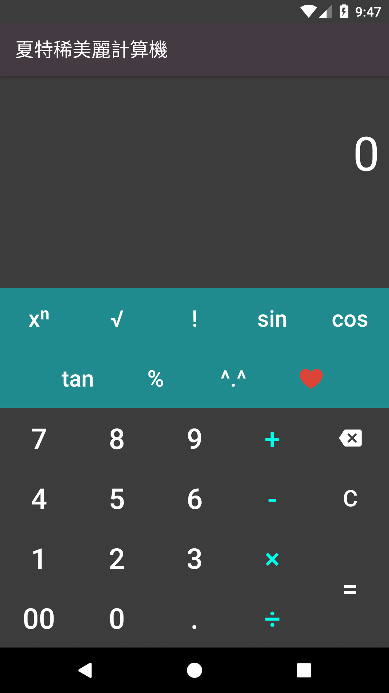
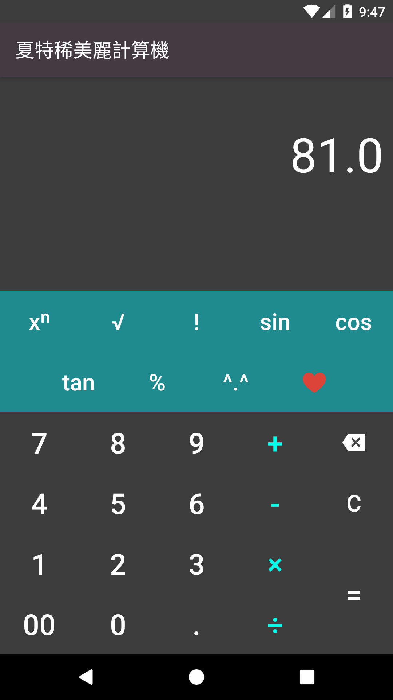
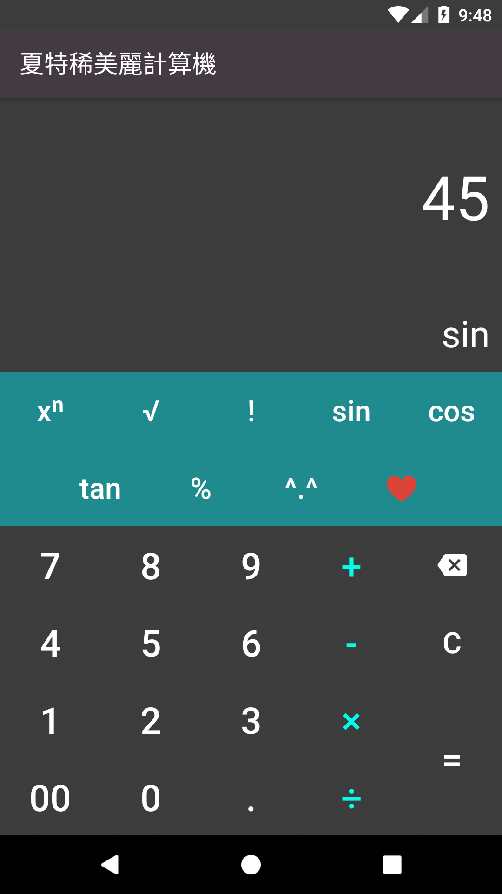
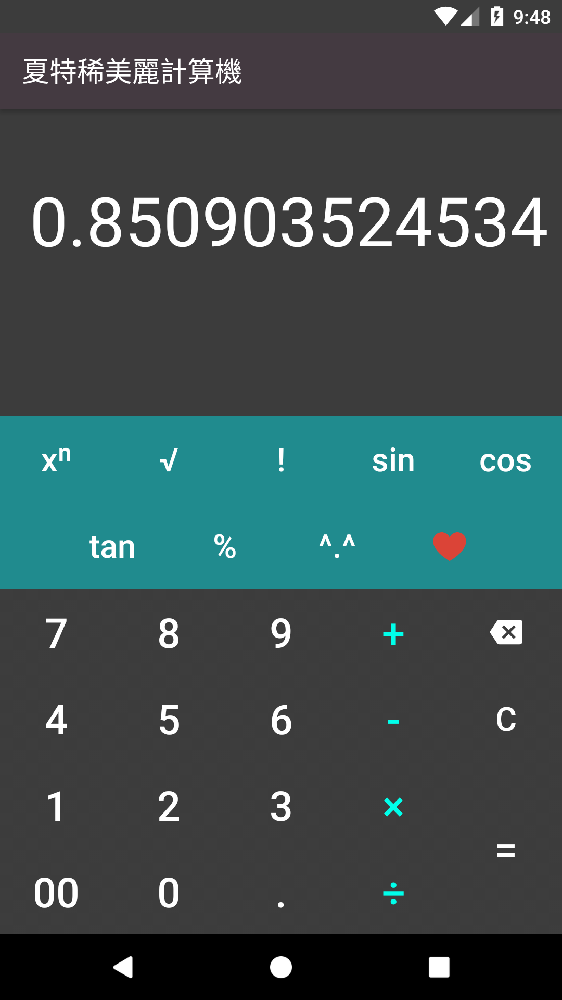
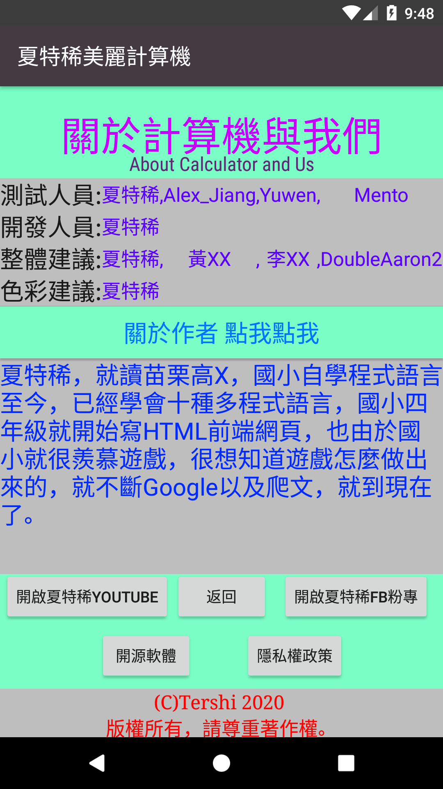

# 夏特稀計算機 Tershi Calculator

這是一款使用Java寫的Android APP，可以使用許多功能，目前也正在維護中，也有在定時更新。

## 目前功能:
支援sin ,cos ,tan ,factorial ,Sqrt ,Power… 未來還會支援更多項目

# 截圖 ScreenShot

點擊看大圖 

## 如何編譯 How to Compile
由於Android-Studio 或是其他IDE已將javac內含至此，所以只須執行就會自動編譯並執行。
### 編譯 Compile:

**Step 1.**``git clone https://github.com/mmm25002500/Calculator/   ``

**Step 2.** 打開Android-Studio

**Step 3.** 打開專案 Open Project

Step 4.Run

### 安裝 Install:

``adb install release.apk``

## 關於我們 About Us

[Team Website](www.tershi.ml)  
[Team Facebook](https://www.facebook.com/shanling.team/)  
[XiaTerShi YouTube](https://www.youtube.com/channel/UCPdpFDFOp3sPbZhRkaQVaQA)  
[XiaTerShi FaceBook](https://www.facebook.com/Tershi25648)  
[Tershi MailServer](https://mail.tershi.ml)  
[Tershi Official WebSite](https://official.tershi.ml)  
[Tershi Gitbook](https://gitbook.tershi.ml)  
以上關於因為域名為免費域(無法使用信用卡申請(未滿18)) 因此隨時會網域更換！  
Licence:© Tershi 2020 All right reversed 此程式除了「關於」頁面不可重製及發布之外，其餘頁面及功能可進行重製發布。
